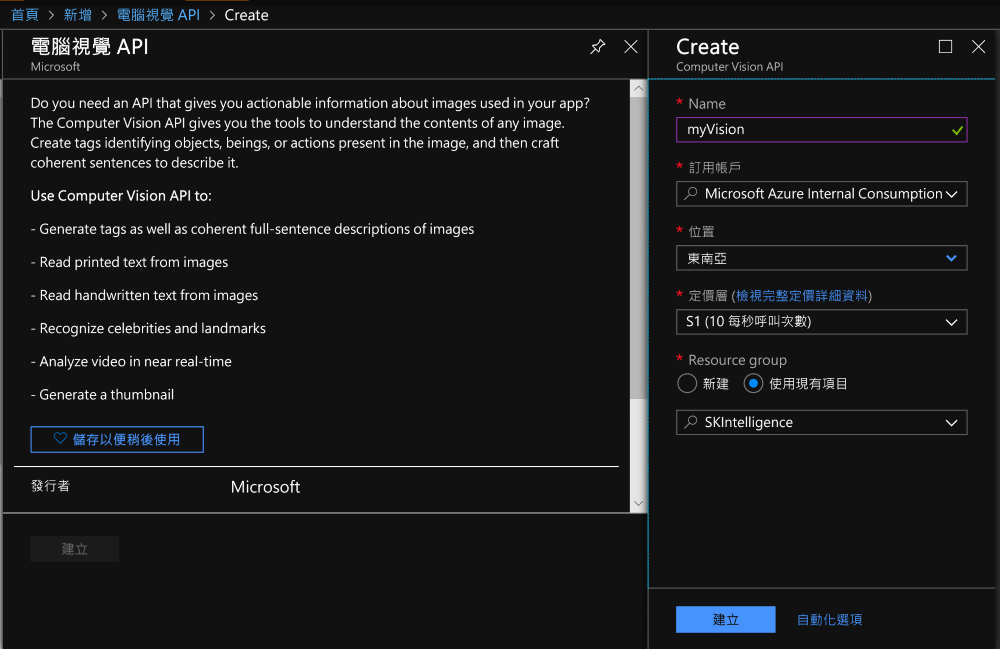
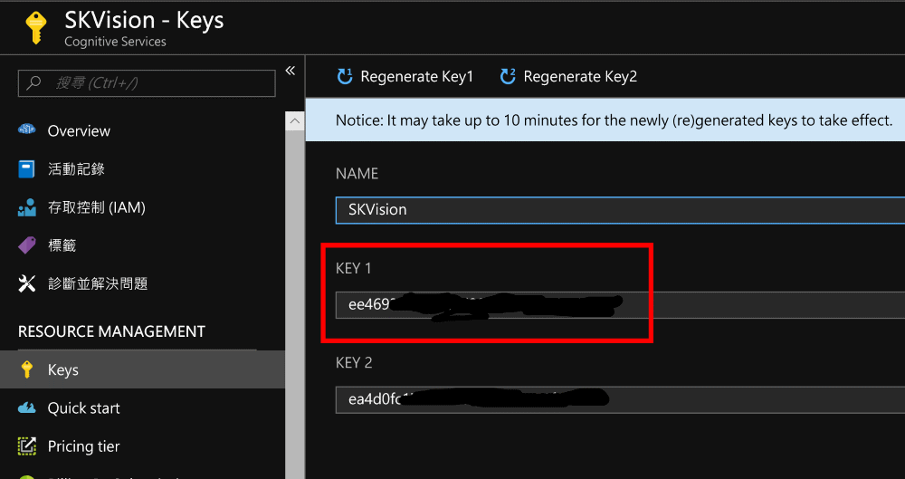

# Azure Computer Vision API Lab

In this lab, there's a simple Python application that use Azure Cognitive Services Python SDK to analyze an image by invoking [Computer Vision API](https://azure.microsoft.com/services/cognitive-services/computer-vision/)

## Steps

1. Go to [Azure Portal](https://portal.azure.com/), add a new instance by searching **Computer Vision** and setup the instance.

   

2. After the service has been successfully created, go to the service blade and check the endpoint location in the _Overview_ section.

   

3. Get API key in the _Keys_ section. Both _KEY 1_ and _KEY 2_ are fine.

   

4. Open the **app.py** file, modify the constants `COMPUTER_VISION_API_LOCATION` and `COMPUTER_VISION_API_KEY`. For example, according to the above figure, it should be  `COMPUTER_VISION_API_LOCATION = 'southeastasia'`.

5. Save the app.py file. Run the following command in terminal to install the dependencies.

   > ```pip install -r requirements.txt```

6. Download an image, rename it to `image.jpg`, and put it under the same directory of app.py. Then, run the command to see what happens.

   > ```python app.py```


## Things to Try

1. Check the latency difference between small image (e.g., < 100KB) and large image (e.g., > 1MB).

2. Check the latency difference if the API request more visual features.
