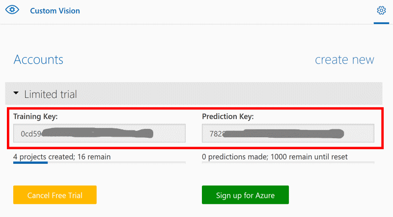

# Azure Custom Vision API Lab

In this lab, you will use a trainer app to train your vision model, and use a predict app to predict the label of an image.

## Steps

1. Sign in [Azure Custom Vision](https://customvision.ai), click the gear icon at the top right corner (or go to https://customvision.ai/projects#/settings directly). Select an account to get the training key and prediction key.

   

2. Open the **train.py** file, fill the training key to the constant `CUSTOMVISION_TRAINING_KEY`. For example, `CUSTOMVISION_TRAINING_KEY = '0cd59......'`

3. Run the following command in the terminal to install the dependencies.

   > pip install -r requirements.txt

4. Run the following command to create a custom vision project and train images.

   > python train.py

5. After completing the training job, go to the Azure Custom Vision portal to see the project.

6. Download an image (or use the original `test_image.jpg` file). Put the training key, prediction key and project name in the **predict.py** file. Then, run the following command to see how your vision model analyzes the image.

   > python predict.py

## Things to Try

1. Try to add another label and images to train a new model.

2. How to download the trained model? How to use the model offline?