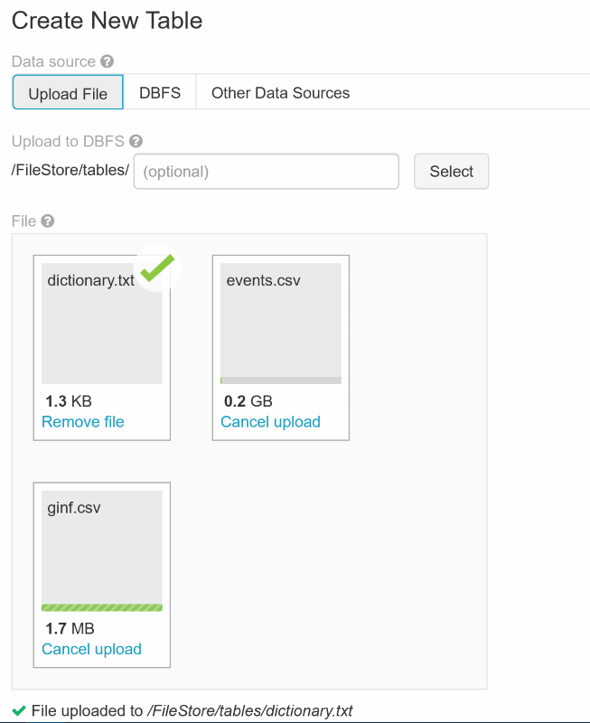
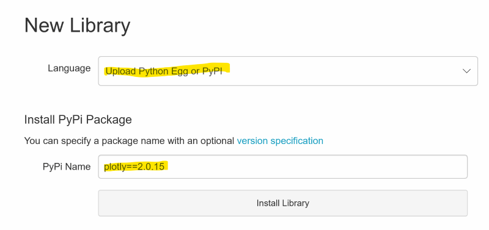
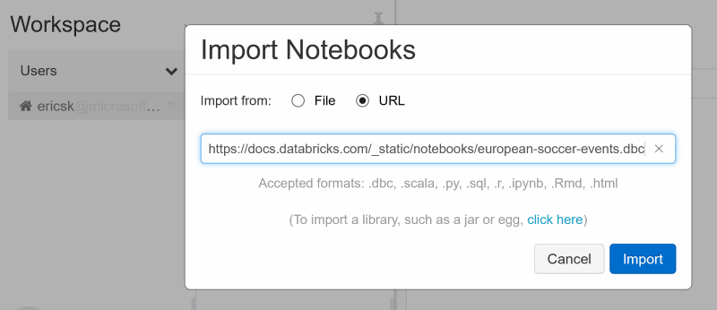

# End-to-end Data Engineering and ML Pipeline for European Soccer Events

This sample comes from [Databricks Resources](https://databricks.com/resources/type/example-notebooks).

## Steps

1. Download the event data from [Kaggle](https://www.kaggle.com/secareanualin/football-events). Click _Download All_ button to download all 3 files.

2. Go to the start page in Azure Databricks portal. Click _Upload Data_ in the **Common Tasks** section. Then, browser the 3 downloaded files and upload them to DBFS.

   

3. The sample notebook uses a Python library `plotly` to draw charts. Go to the start page in Azure Databricks portal. Click _Import Library_ in the **Common Tasks** section. Select _Upload Python Egg or PyPI_ in the **Language** field; use `plotly==2.0.15` in the **PyPi Name** field. Finally, click _Install Library_ button to install this library.

   

4. Go to **Workspace** tab, click the arrow icon (options) besides your account and select _Import_. Import notebooks from URL `https://docs.databricks.com/_static/notebooks/european-soccer-events.dbc`.

   

5. Open the **european_soccer_events_01_etl** notebook, modify the following parts:

    ```
    (cmd4)
    %fs ls /FileStore/tables
    ```

    ```
    (cmd5)
    %sh head /dbfs/FileStore/tables/events.csv
    ```

    ```python
    (cmd7)
    eventsDF = (spark.read.csv("/FileStore/tables/events.csv",
    ...
    ```

    ```python
    (cmd8)
    gameInDF = (spark.read.csv("/FileStore/tables/ginf.csv",
    ...
    ```

    ```sql
    (cmd16)
    %sql
    CREATE DATABASE IF NOT EXISTS EURO_SOCCER_DB
    LOCATION "dbfs:/FileStore/databricks-abhinav/eu-soccer-events/interm
    ```

6. Run all cells to see how it works.