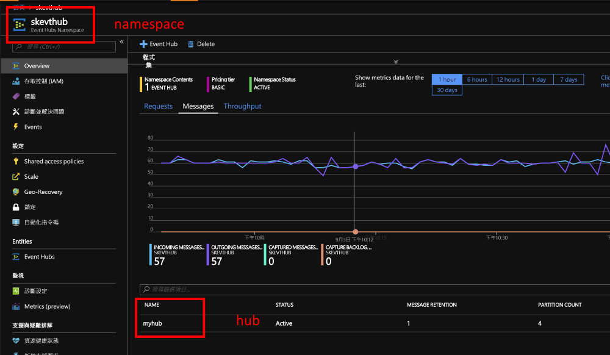
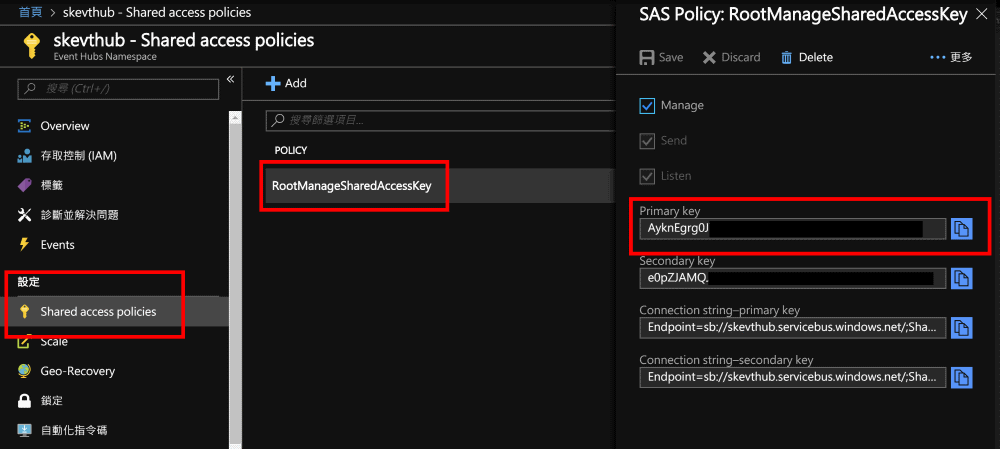

# Mobile Event Stream ETL Lab

This lab is inspired from [Mobile Gaming Event Data Pipeline with Databricks](https://docs.databricks.com/_static/notebooks/mobile-event-stream-etl.html). In this lab, we will use [Azure Event Hubs](https://azure.microsoft.com/services/event-hubs/) instead of AWS Kinesis.

## Steps

1. Create a Event Hub namespace from Azure Portal and then create a hub in the namespace.

   

2. Get the policy and key in the **Shared access policies** section in order to access the eventhub.

   

3. We have to start the event generator first. Open **event_gen.py** file, modify the `ADDRESS`, `USER`, and `KEY` value to your event hub. Then run the following commands in the terminal.

   Install the dependencies:

   > `pip install -r requirements.txt`

   Run the event generator (use _Ctrl+C_ to interrupt the program):

   > `python event_gen.py`

4. Follow the [Azure Event Hubs - Databricks Documentation](https://docs.azuredatabricks.net/spark/latest/structured-streaming/streaming-event-hubs.html) page to install the event hub library for Databricks.

   > We will use PySpark (Python) to run the stream processing scripts, however, Databricks needs this JVM-based library.

5. Import the notebook from `https://raw.githubusercontent.com/ericsk/learning-msai/master/Databricks/StreamProcessing/Mobile%20Event%20Stream%20ETL.py`.

6. Modify the `connectionString` value to your Event Hub. Then, go through each cmds to understand how Databricks/Spark does stream processing.

